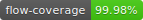

[](https://jestjs.io)
[](http://flow.org)
[](https://circleci.com/gh/blockchain/components/tree/master)

[](http://standardjs.com)
[](https://github.com/prettier/prettier)
[](https://conventionalcommits.org)

# Description
The library **Components** is based on React and styled-components. It contains basic components, "atoms", and more complex "molecules" that are used on the [Blockchain.com](https://www.blockchain.com) ecosystem.

# Installation

Just a quick `npm i @blockchain-com/components` and you are good to go!

# Tips

## Icons usage

### 1. FontAwesome icons (free version)
Use `<Fas... />`

* **`Fas`** is the type ("Fab", "Far" and "Fas" are avaible)
  * `Fab` matches the brand iconset
  * `Fas` matches the solid iconset
  * `Far` matches the regular iconset

* **`...`** is the FontAwesome icon name formatted as [PascalCase](http://wiki.c2.com/?PascalCase).

The full icon list is available [here](https://fontawesome.com/icons)

Examples:

```javascript
<FasCheckCircle />
<FarCheckCircle />
<FabFacebook />
```


### 2. Crypto icons
Use `<Crypto.../>`

* **`...`** is the icon name formatted as [PascalCase](http://wiki.c2.com/?PascalCase).

The list of crypto icons is available [here](http://cryptoicons.co/)

Examples:

```javascript
<CryptoBtc />
<CryptoXlm />
```


### 3. Custom (bc) icons
Use `<Bc... />`

* **`...`** is the icon name formatted as [PascalCase](http://wiki.c2.com/?PascalCase).

The list of custom icons is available [here](https://github.com/blockchain/components/blob/master/src/Atoms/Icons/custom/index.js)

Examples:

```javascript
<BcBlocks />
<BcTransactions />
```


# Development

## Tooling

Both `yarn` and `npm` are supported.

The commands are given using `npm` however you can use the `yarn` equivalent and it will *Just Work™*

## Link

If you want to change the library and reflect your changes on your consumer app without having to push to the repo and release, just:

1. `git clone git@github.com:blockchain/components.git`
2. `cd path-to/components`
3. `npm link`
4. `cd path-to/my-app`
5. `npm link @blockchain-com/components`

:zap: you need to run `npm link @blockchain-com/components` everytime you run `npm i` or `yarn`...

## Storybook

1. Ensure Node version >= 8.0 is installed
2. Install packages: `npm i`
3. Start application in dev mode: `npm run start`
4. The library will now be accessible at [localhost:6006](http://localhost:6006)

# Architecture
This library follows the [Atomic Design](http://atomicdesign.bradfrost.com/chapter-2/) principles.

An additional attention has be taken to ensure that all components are available and fully functional accross major web browsers*, as well as responsive on any screen sizes.

Browsers with > 1% usage:
* IE 11
* Safari 11+
* Chrome / Edge / Firefox latest 2 major versions

# Code Quality

## 1. Linting
The coding style rules are defined by [Prettier](https://prettier.io/) and enforced by [Eslint](https://eslint.org)

The ```good practices™``` that we follow are defined by the [Javascript Standard Style](https://standardjs.com/rules.html)

Following commands are available:
* `npm run lint:js`
  * Lints JS code
* `npm run lint:css`
  * Lints styled components

## 2. Unit Tests

Testing is done using [Jest](https://facebook.github.io/jest/) and [Enzyme](http://airbnb.io/enzyme/).

Following commands is available:
* `npm test`
  * Run the unit tests


## 3. Git Hooks
We use [Husky](https://github.com/typicode/husky) to automatically deploy git hooks

On every `git commit` and `git push` we run the unit tests and the linting tasks.

The commit messages are also validated and must follow the [Conventional Commits](https://conventionalcommits.org/) spec.
